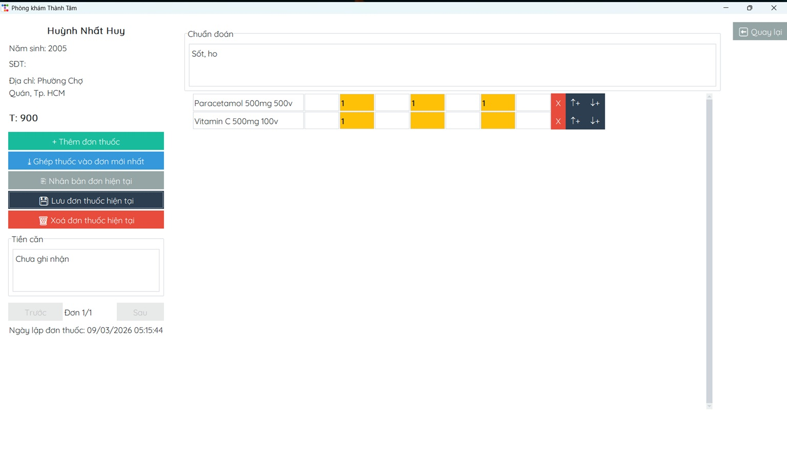

# MediTrack — Desktop Medical Records App

A desktop application for managing patient medical records, prescriptions, and medicine inventory. Built at the request of a practicing physician to replace manual record-keeping at a real clinic.

> UI is in Vietnamese to suit the clinic's workflow.

## Screenshot

## Download

**[Download latest release (v1.36)](https://github.com/hetoke/meditrack/releases/latest)**

No installation required — just download and run the `.exe`.

**Requirements:** Windows 10/11

## Features

### Patient Records
- Paginated record list (15 items/page) with name, year, and last modified timestamp
- Search by surname and year with autocomplete
- Records sorted by latest modified at the top

### Prescription Management
- Duplicate, append, and reorder prescription rows (insert above/below)
- Zoom in/out on prescription view
- Resizable columns with Enter key navigation between fields
- Bold dose numbers for readability
- Unsaved-change detection before exit
- Auto-updates timestamp on every save

### Medicine
- Autocomplete search with Vietnamese collation support
- Alphabetical sorting
- Minimum 8 medicines visible per screen

## Tech Stack

- Python
- Tkinter (GUI)
- SQLAlchemy (ORM)
- SQLite (Database)
- PyInstaller (Packaging)

## Development

This project was developed over 5 months (Sep 2025 – Feb 2026) and has been in production use at a real clinic since February 2026.

## Author

Built by [Huynh Nhat Huy](https://github.com/hetoke)